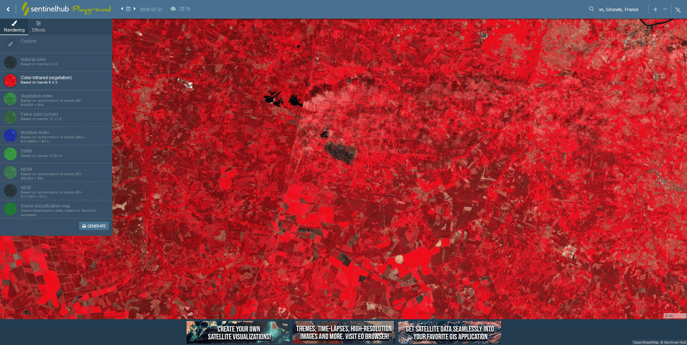
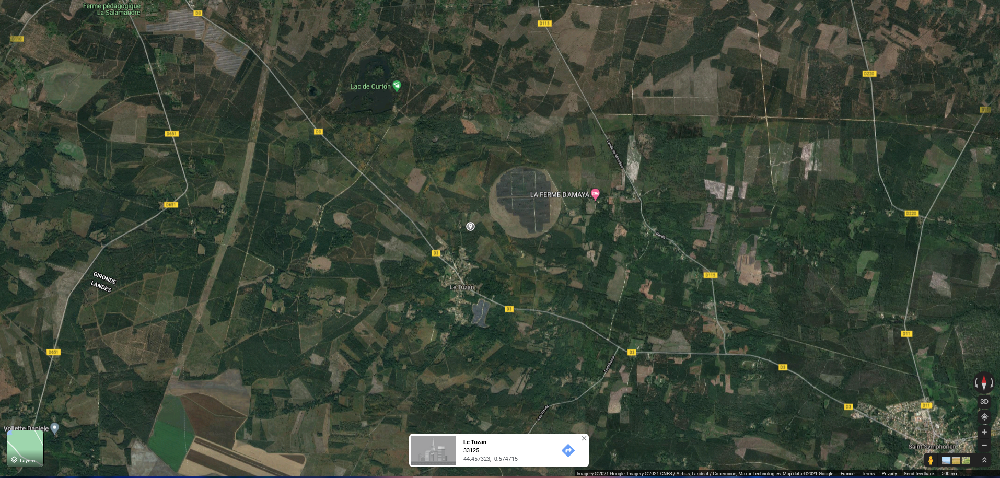
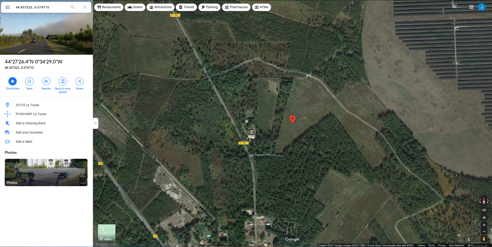

# Instructions

## Creating a GeoJSON file

This is a step-by-step guide for creating GeoJSON files containing the location of a given wildfire. These files are similar to the following:

```JSON
{
    "type": "FeatureCollection",
    "features": [
        {
            "type": "Feature",
            "properties": {},
            "geometry": {
                "type": "Polygon",
                "coordinates": [
                    [
                        [
                            6.319198608398437,
                            43.25320494908846
                        ],
                        [
                            6.550598144531249,
                            43.25320494908846
                        ],
                        [
                            6.550598144531249,
                            43.38159664007785
                        ],
                        [
                            6.319198608398437,
                            43.38159664007785
                        ],
                        [
                            6.319198608398437,
                            43.25320494908846
                        ]
                    ]
                ]
            }
        }
    ]
}
```

The polygon created using this method is a rectangle surrounding the wildfire area.

As mentioned in the [README](README.md) file, you need the location of the affected area:

1. Go to the [Sentinel Playground](https://apps.sentinel-hub.com/sentinel-playground/) website. It should look like this: 
2. Search for the location in the top-right search bar, select the date in the calendar, and finally, select the infrared filter on the left (the wildfires are more visible)
3. This is the result for "Le Tuzan" on July 27, 2020 (date of the wildfire):

4. When selecting a later date, for example July 29, this is the result:

As you can see, a black patch appears on the image, indicating the burned area. However, if the cloud coverage is very high, move the cursor next to the date bar and reduce the threshold. This will clear up the image.

5. Once you have located the fire, go to [geojson.io](https://geojson.io/):  and navigate to the area of interest
6. Once you are there, use the "Draw a rectangle" tool on the right-hand side to cover the area. You can make sure you have the correct area by clicking on the "Satellite" option on the bottom-left corner
7. For the wildfire in Le Tuzan, this is the result: 
8. Finally, save the selection by clicking on "Save > GeoJSON", save it inside the [geojson_files](data/geojson_files/) folder, and rename the file to `FIRE_NAME.geojson`, for example `tuzan.geojson`

The created rectangle will be the shape of reference when calling the Sentinel API, so you will retrieve an image containing it.

## Retrieving a pair of coordinates from the wildfire

In order to create the JSON files needed for calling the Sentinel API, you also need a pair of coordinates _latitude_ and _longitude_.

You can follow this guide to retrieve them:

1. First, open [Google Maps](https://www.google.com/maps/) and search for the affected area, as shown in the previous guide
2. Then, click on the area of interest to place a marker. The coordinates will appear on the lower side of the screen: 
3. Finally, click on the coordinates so that a menu on the left side of the screen opens and you can copy them: 
    Make sure to copy the smaller coordinates, not the larger ones
4. Paste these values into the JSON file created in the first guide
